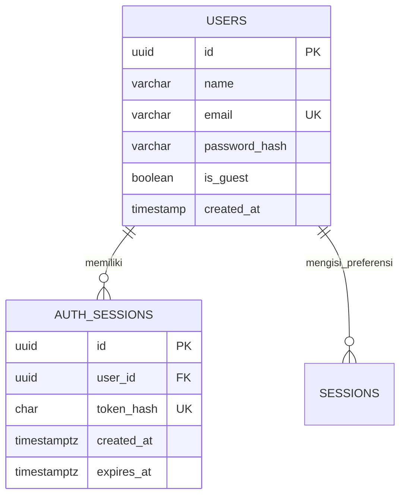

# API User & Auth MauMakan

Implementasi untuk dua issue terbuka paling awal milik **AmeliaOchaM**:

- [#4 — Merancang skema database User & Auth](https://github.com/theoimmanuel/MauMakan/issues/4): skema akun/guest, constraint identitas, indeks email unik tanpa membedakan kapitalisasi, serta sesi autentikasi.
- [#5 — Implementasi API Login/Daftar Akun](https://github.com/theoimmanuel/MauMakan/issues/5): endpoint register/login dengan validasi email/password, terhubung ke form frontend; dilengkapi guest, pemeriksaan sesi, dan logout.

## Menjalankan lokal

Prasyarat: Node.js 22.13+ dan PostgreSQL 16+. Jalankan perintah berikut dari direktori `be`:

```sh
npm ci
cp .env.example .env
createdb maumakan
psql -v ON_ERROR_STOP=1 -d maumakan -f erd/mau_makan_apa_schema.sql
npm run dev
```

Sesuaikan `DATABASE_URL` di `.env` dengan akun PostgreSQL lokal. Server mendengarkan `127.0.0.1:3000` dan menerima origin frontend `http://localhost:5173`. Jika port/origin frontend berubah, sesuaikan `FRONTEND_ORIGIN`.

Untuk database yang **sudah memiliki skema ERD lama**, gunakan `migrations/001_user_auth.sql` satu kali sebagai pengganti skema penuh. Migrasi mempertahankan data dan relasi yang ada. Migrasi akan gagal secara transaksional bila data lama mengandung email duplikat tanpa membedakan kapitalisasi, akun tanpa kredensial, atau guest dengan kredensial; rapikan data tersebut sebelum menjalankan ulang. Jangan jalankan migrasi setelah mengimpor skema penuh terbaru, karena skema terbaru sudah memuat perubahan ini. Password hash lama di luar format scrypt API ini perlu proses reset password terpisah.

Di terminal lain, dari direktori `fe`:

```sh
npm ci
cp .env.example .env
npm run dev
```

Buka `http://localhost:5173`. Isi `VITE_API_BASE_URL` sesuai alamat API. Konfigurasi Supabase hanya diperlukan untuk katalog makanan yang sudah ada. API akun menggunakan PostgreSQL melalui backend ini; tokennya bukan token Supabase Auth dan tidak memberi akses ke RLS Supabase. Tanpa konfigurasi katalog, halaman autentikasi tetap bisa digunakan dan halaman hasil menampilkan pesan katalog belum dikonfigurasi.

## Skema User & Auth



Akun biasa wajib memiliki email dan hash password. Guest memiliki UUID sendiri dengan `is_guest=true`, email dan password hash NULL. Tabel `sessions` pada ERD tetap merupakan sesi **preferensi makanan**, berbeda dari `auth_sessions`. Penghapusan user ikut menghapus sesi autentikasinya.

Password di-hash menggunakan scrypt dengan salt acak per akun (N=32768, r=8, p=1). Token acak 32 byte berlaku 24 jam; hanya SHA-256 token disimpan dalam database. Respons API tidak menyertakan password/hash. Frontend menyimpan token dalam `sessionStorage` tab, memverifikasinya lewat `/auth/me` saat dimuat ulang, dan menghapusnya saat logout. Pengiriman kredensial dibatasi 30 permintaan per menit per IP pada satu proses server. Implementasi ini untuk pengembangan lokal, tidak melakukan provisioning/deployment.

## Kontrak API

Semua respons berupa JSON. POST register/login/guest wajib memakai `Content-Type: application/json`.

| Method | Endpoint | Input | Sukses |
|---|---|---|---|
| POST | `/auth/register` | `{ "name": "Amelia", "email": "amelia@example.com", "password": "contoh-rahasia-123" }` | 201 `{ user, token, expires_at }` |
| POST | `/auth/login` | `{ "email": "amelia@example.com", "password": "contoh-rahasia-123" }` | 200 `{ user, token, expires_at }` |
| POST | `/auth/guest` | `{}` | 201 `{ user, token, expires_at }` |
| GET | `/auth/me` | Header `Authorization: Bearer <token>` | 200 `{ user }` |
| POST | `/auth/logout` | Header `Authorization: Bearer <token>` | 200 `{ message }` |

`user` berisi `id`, `name`, `email`, `is_guest`, `created_at`. Nama wajib 1–100 karakter setelah trim; email maksimal 150 karakter, dinormalisasi trim/lowercase; password 8–128 karakter, tidak di-trim. Error berbentuk `{ "message": "..." }`: 400 validasi/JSON, 401 kredensial atau sesi tidak valid, 403 origin ditolak, 409 email duplikat, 413 payload terlalu besar, 415 content type salah, 429 terlalu banyak percobaan, 500 kesalahan internal. Logout hanya mencabut sesi token yang dikirim.

Contoh:

```sh
curl http://localhost:3000/auth/register \
  -H 'Content-Type: application/json' \
  -d '{"name":"Amelia","email":"amelia@example.com","password":"contoh-rahasia-123"}'
```

## Pengujian

Gunakan database lokal **khusus pengujian**, karena test membuat dan menghapus schema sementara:

```sh
createdb maumakan_test
TEST_DATABASE_URL=postgresql://localhost:5432/maumakan_test npm test
npm run lint --prefix ../fe
npm run build --prefix ../fe
```

14 test otomatis mencakup register, kerahasiaan hash, duplikasi email, validasi, login, kredensial salah, SQL injection, guest, autentikasi token, kedaluwarsa, logout, payload, CORS, constraint database, rollback register jika pembuatan sesi gagal, pembatasan percobaan, serta migrasi data lama. Test menggunakan HTTP dan PostgreSQL nyata. Error `Auth API error: P0001` selama test rollback memang sengaja dipicu.

Cek alur browser: daftar → preferensi → refresh (sesi dipulihkan) → tab Login → Keluar → login salah (pesan error) → login benar → Keluar → Lanjut sebagai Guest. Form juga menampilkan status proses/error dan menahan akses halaman lain sebelum autentikasi.

Rujukan implementasi: [Node.js crypto](https://nodejs.org/api/crypto.html) dan [parameterized queries node-postgres](https://node-postgres.com/features/queries).

## Hasil verifikasi lokal — 1 Oktober 2026

- `npm test`: **14/14 lulus** menggunakan PostgreSQL 16 sementara, termasuk instalasi skema baru dan migrasi skema lama.
- `npm run lint --prefix ../fe`: lulus.
- `npm run build --prefix ../fe`: lulus.
- Browser Chrome headless melalui Playwright, viewport 390 × 844: daftar, refresh sesi, logout, password salah, login benar, guest, email duplikat, dan error jaringan lulus; tidak ada JavaScript page error. Browser menggunakan API dan PostgreSQL nyata; hanya skenario error jaringan yang sengaja memutus request.
- Tidak ada deployment, push Git, perubahan database cloud, atau penutupan issue GitHub.

## Google Places — issue #14 dan #15

Backend menggunakan [Text Search (New)](https://developers.google.com/maps/documentation/places/web-service/text-search) dengan filter restoran dan lokasi manual. Request dikirim dari server dengan field mask eksplisit; API key tidak dikirim ke frontend.

### Konfigurasi

1. Di Google Cloud, aktifkan billing dan **Places API (New)**. Buat API key yang dibatasi ke Places API (New), serta IP server jika memakai IP keluar tetap.
2. Tambahkan `GOOGLE_PLACES_API_KEY=...` di `be/.env` (lihat `.env.example`). Jangan menggunakan prefiks `VITE_` untuk key ini. Field rating dan kategori harga termasuk field berbayar; atur kuota di project Google Cloud.
3. Database baru: jalankan skema lengkap seperti panduan sebelumnya. Database yang sudah ada: jalankan `psql "$DATABASE_URL" -v ON_ERROR_STOP=1 -f migrations/002_google_places.sql` dari folder `be`. Migrasi menambahkan keunikan `google_place_id` dan mengizinkan nama kosong untuk record referensi Google. Jika data lama memiliki ID Google duplikat, migrasi berhenti; selesaikan duplikasi dan relasi secara manual sebelum mengulang.
4. Jalankan backend dan frontend seperti biasa. `VITE_API_BASE_URL` harus menunjuk backend. Supabase tidak diperlukan untuk halaman hasil tempat makan.
5. Login atau masuk sebagai guest, isi lokasi (contoh `Sleman, Yogyakarta`), lalu pilih **Cari Rekomendasi**. **Surprise Me** memilih posisi awal secara acak dari hasil pencarian lokasi yang sama.

### Kontrak API dan penyimpanan

`POST /recommendations` membutuhkan `Authorization: Bearer <token>` dan JSON `{ "location": "Sleman, Yogyakarta" }`. Lokasi wajib 1–200 karakter. Respons `{ "places": [...] }` berisi maksimal 20 hasil: `id` (Google Place ID), `placeId` (UUID lokal), `name`, `address`, `category`, `rating`, `userRatingCount`, `priceLevel`, `googleMapsUri`, `attributions`, dan `foods`.

Google Place ID di-upsert secara transaksional ke tabel `places`; ID lokal tetap sama pada pencarian berulang. Sesuai [kebijakan Places API](https://developers.google.com/maps/documentation/places/web-service/policies), konten tampilan Google diambil baru dan tidak disalin permanen ke database. Data tempat yang sebelumnya diisi secara independen tetap dipertahankan. UI menampilkan atribusi Google Maps dan atribusi penyedia jika tersedia.

`PlaceFood` pada issue direpresentasikan oleh `food_places` pada skema proyek. Relasi menu yang sudah diisi dalam `foods` dan `food_places` ikut dibaca dan ditampilkan sebagai katalog MauMakan. Google Places tidak menyediakan daftar menu beserta harga per item sehingga pencarian tidak membuat relasi menu otomatis. `priceLevel` adalah kategori harga tempat, bukan estimasi harga rupiah. Budget, tipe makanan, dan mood belum digunakan untuk penyaringan; UI menjelaskan batasan ini.

Error: 400 lokasi tidak valid, 401 sesi tidak valid, 429 batas request lokal, 503 key belum dikonfigurasi/kuota Google, 502 kegagalan provider, 504 timeout Google (10 detik). Respons error tidak membocorkan key atau payload error Google. UI menyediakan status proses, hasil kosong, ubah lokasi, dan coba lagi.

### Verifikasi — 2 Oktober 2026

- `node --test test/places.test.js`: tes kontrak Google dengan respons simulasi; tidak memerlukan key/database.
- `TEST_DATABASE_URL=... npm test`: **23/23 lulus**, termasuk regresi auth, HTTP/PostgreSQL nyata, ID tempat stabil, serta relasi menu.
- Lint dan build frontend lulus.
- Chrome headless 390 × 844: guest, validasi lokasi, hasil API, tautan Maps, hasil kosong, error jaringan dan retry lulus tanpa JavaScript page error. Google disimulasikan; backend dan PostgreSQL berjalan nyata.
- Request ke Google secara langsung belum diverifikasi karena belum tersedia API key aktif. Setelah konfigurasi, ulangi pencarian dari UI untuk memverifikasi key, billing, dan kuota project.
